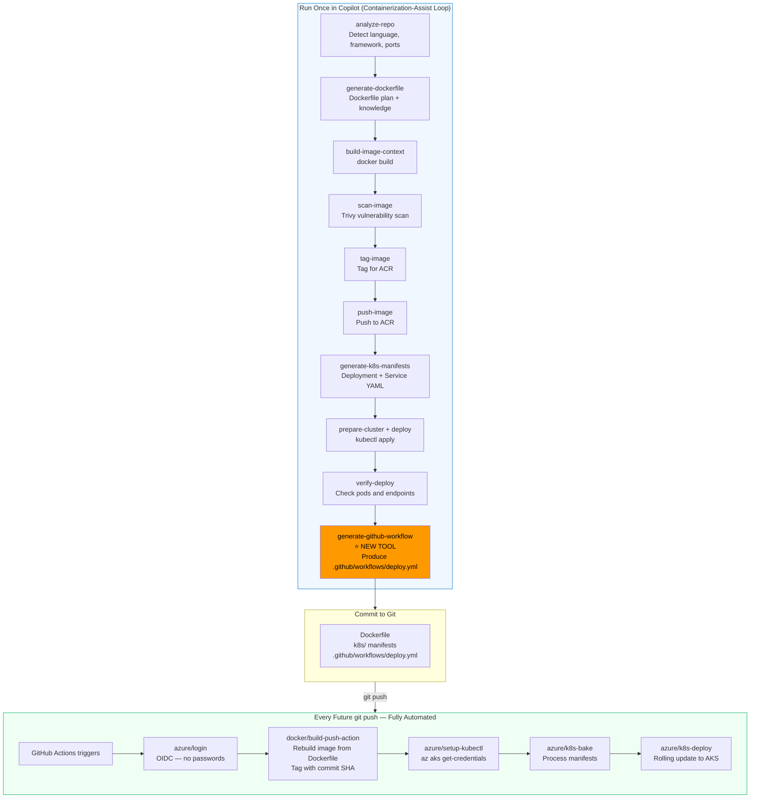

# Plan: `generate-github-workflow` Tool

## Problem Statement

After containerization-assist runs steps 1–7 and deploys the app to AKS, any future code change requires the entire loop to be re-run manually from `analyze-repo`. This does not scale for teams pushing code regularly.

## Solution

Add a `generate-github-workflow` tool at the end of the containerization-assist loop. This tool uses the knowledge-tool pattern (same as `generate-dockerfile`) to produce a `.github/workflows/deploy.yml` file. Once committed, GitHub Actions handles all future deployments automatically — no Copilot, no manual steps, no re-running the loop.

---

## What the Generated Workflow Looks Like

The tool instructs Copilot to generate a two-job GitHub Actions workflow:

```yaml
name: Build and Deploy to AKS

on:
  push:
    branches: [main]
  workflow_dispatch:

concurrency:
  group: ${{ github.workflow }}-${{ github.ref }}
  cancel-in-progress: true

permissions:
  id-token: write   # Required for Azure OIDC
  contents: read

jobs:
  build-and-push:
    runs-on: ubuntu-latest
    outputs:
      image-tag: ${{ steps.meta.outputs.tags }}

    steps:
      - uses: actions/checkout@v4

      - name: Azure Login (OIDC)
        uses: azure/login@v2
        with:
          client-id: ${{ secrets.AZURE_CLIENT_ID }}
          tenant-id: ${{ secrets.AZURE_TENANT_ID }}
          subscription-id: ${{ secrets.AZURE_SUBSCRIPTION_ID }}

      - name: Login to ACR
        uses: azure/docker-login@v2
        with:
          login-server: myregistry.azurecr.io

      - name: Build and push image
        uses: docker/build-push-action@v5
        with:
          context: .
          push: true
          tags: myregistry.azurecr.io/myapp:${{ github.sha }}
          cache-from: type=gha
          cache-to: type=gha,mode=max

  deploy:
    needs: build-and-push
    runs-on: ubuntu-latest
    environment: production

    steps:
      - uses: actions/checkout@v4

      - name: Azure Login (OIDC)
        uses: azure/login@v2
        with:
          client-id: ${{ secrets.AZURE_CLIENT_ID }}
          tenant-id: ${{ secrets.AZURE_TENANT_ID }}
          subscription-id: ${{ secrets.AZURE_SUBSCRIPTION_ID }}

      - name: Setup kubectl
        uses: azure/setup-kubectl@v4

      - name: Get AKS credentials
        run: |
          az aks get-credentials \
            --resource-group ${{ vars.RESOURCE_GROUP }} \
            --name ${{ vars.CLUSTER_NAME }} \
            --overwrite-existing

      - name: Bake manifests
        uses: azure/k8s-bake@v1
        with:
          renderType: manifests
          manifests: k8s/
        id: bake

      - name: Deploy to AKS
        uses: azure/k8s-deploy@v5
        with:
          namespace: ${{ vars.K8S_NAMESPACE }}
          manifests: ${{ steps.bake.outputs.manifestsBundle }}
          images: myregistry.azurecr.io/myapp:${{ github.sha }}
```

### Required GitHub Secrets & Variables

| Type | Name | Value |
|---|---|---|
| Secret | `AZURE_CLIENT_ID` | App registration client ID (OIDC federated credential) |
| Secret | `AZURE_TENANT_ID` | Azure Entra ID tenant ID |
| Secret | `AZURE_SUBSCRIPTION_ID` | Azure subscription ID |
| Variable | `RESOURCE_GROUP` | Azure resource group name |
| Variable | `CLUSTER_NAME` | AKS cluster name |
| Variable | `K8S_NAMESPACE` | Kubernetes namespace (e.g. `production`) |

---

## How the Tool Fits into the Overall Design



---

## Implementation Phases

### Phase 1 — Knowledge Pack
**Create** `knowledge/packs/github-actions-pack.json`

This is the recipe book of GitHub Actions best practices the tool will query. Each entry is one piece of advice with an example. The pack is auto-embedded into the binary at the next `npm run build:knowledge` — no manual import required.

**Entries (12 total):**

| ID | Purpose | Severity |
|---|---|---|
| `github-oidc-permissions` | `id-token: write` + `contents: read` permissions block | required |
| `azure-login-oidc` | `azure/login@v2` with the 3 OIDC secrets | required |
| `acr-docker-login` | `azure/docker-login@v2` after OIDC login | high |
| `docker-build-push-acr` | `docker/build-push-action@v5` with `github.sha` tag | high |
| `aks-setup-kubectl` | `azure/setup-kubectl@v4` step | high |
| `aks-get-credentials` | `az aks get-credentials` shell command | high |
| `k8s-bake-manifests` | `azure/k8s-bake@v1` with manifest directory input | medium |
| `k8s-deploy-action` | `azure/k8s-deploy@v5` with namespace + bake output | required |
| `github-environment-gates` | GitHub Environments for production protection rules | medium |
| `workflow-docker-layer-cache` | `actions/cache` via `cache-from/cache-to: type=gha` | medium |
| `workflow-concurrency` | `concurrency` block with `cancel-in-progress: true` | medium |
| `required-secrets-guidance` | Summary of secrets and variables to configure | high |

**Entry format:**
```json
{
  "id": "azure-login-oidc",
  "category": "cicd",
  "pattern": "azure/login",
  "recommendation": "Use azure/login@v2 with OIDC federated credentials — never store passwords as secrets",
  "example": "- uses: azure/login@v2\n  with:\n    client-id: ${{ secrets.AZURE_CLIENT_ID }}\n    tenant-id: ${{ secrets.AZURE_TENANT_ID }}\n    subscription-id: ${{ secrets.AZURE_SUBSCRIPTION_ID }}",
  "severity": "required",
  "tags": ["generate-github-workflow", "azure-oidc", "azure-login", "github-actions", "security"],
  "description": "OIDC federated credentials eliminate long-lived secrets entirely"
}
```

---

### Phase 2 — Type Extensions
**Files:** `src/types/topics.ts`, `src/knowledge/types.ts`, `src/knowledge/schemas.ts`

Small additions to the type system so the knowledge system knows about the new domain:

- **`src/types/topics.ts`** — add `GITHUB_WORKFLOW: 'github_workflow'` to the `TOPICS` constant. This is the search key the tool uses to query the knowledge base.
- **`src/knowledge/types.ts`** — add `CICD: 'cicd'` to the `CATEGORY` constant. Keeps GitHub Actions knowledge separate from dockerfile/kubernetes entries.
- **`src/knowledge/schemas.ts`** — add `'cicd'` to the `KnowledgeCategorySchema` Zod enum so validation passes.

---

### Phase 3 — Tool Files
**Create** `src/tools/generate-github-workflow/` with three files:

#### `types.ts` — Tool identity card
Exports `generateGithubWorkflowToolDefinition`:
- Name, description, category, version
- `metadata: { knowledgeEnhanced: true }` — signals the tool uses the knowledge base
- `chainHints.success` — tells Copilot what to say next: *"Commit `.github/workflows/deploy.yml` and configure AZURE_CLIENT_ID, AZURE_TENANT_ID, AZURE_SUBSCRIPTION_ID as GitHub repository secrets. Set up an OIDC federated credential in Azure for your GitHub repo."*

#### `schema.ts` — Input/output contract
**Inputs (Zod schema):**

| Field | Type | Required | Default | Description |
|---|---|---|---|---|
| `repositoryPath` | `string` | ✅ | — | Path to the repo |
| `registry` | `string` | ✅ | — | ACR login server (e.g. `myregistry.azurecr.io`) |
| `clusterName` | `string` | ✅ | — | AKS cluster name |
| `resourceGroup` | `string` | ✅ | — | Azure resource group |
| `imageName` | `string` | ❌ | repo dir name | Docker image name |
| `namespace` | `string` | ❌ | `default` | Kubernetes namespace |
| `environment` | `enum` | ❌ | `production` | `development` / `staging` / `production` |
| `manifestFormat` | `enum` | ❌ | `k8s` | `k8s` / `helm` / `kustomize` |
| `branches` | `string[]` | ❌ | `['main']` | Branches that trigger the workflow |
| `manifestPath` | `string` | ❌ | — | Path to existing manifests directory |
| `language` | `string` | ❌ | — | From `analyze-repo` (for cache hints) |
| `framework` | `string` | ❌ | — | From `analyze-repo` (for cache hints) |

**Output types:**
- `GithubWorkflowPlan` — `nextAction`, `workflowJobs`, `secretsRequired`, `summary`, `attributionLabels`
- `WorkflowJobDescription` — `name`, `steps`, `runsOn`, `environment`

#### `tool.ts` — Core logic
Implements the `createKnowledgeTool` pattern (identical factory to `generate-dockerfile`):

**Step 1 — Query the knowledge base:**
- Topic: `TOPICS.GITHUB_WORKFLOW`
- Category: `CATEGORY.CICD`
- Max 15 snippets, 6000 chars
- Filters: `language`, `framework`, `environment`

**Step 2 — Categorise into 4 buckets:**
- `auth` — entries tagged `azure-oidc`, `azure-login`
- `build` — entries tagged `docker-build`, `acr`, `registry`
- `deploy` — entries tagged `aks`, `kubectl`, `k8s-deploy`, `k8s-bake`
- `bestPractices` — everything else (caching, environments, concurrency)

**Step 3 — Apply rules:**
- Include `k8s-bake` step if `manifestFormat === 'helm'` or `'kustomize'`
- Always include concurrency block
- Always set `runsOn: 'ubuntu-latest'`

**Step 4 — Build the plan:**
Returns `GithubWorkflowPlan` with:
- `nextAction.action: 'create-files'`
- `nextAction.files: [{ path: '.github/workflows/deploy.yml', purpose: 'CI/CD workflow' }]`
- `nextAction.instruction` — full prompt for Copilot to generate the YAML, incorporating all categorised knowledge snippets
- `secretsRequired: ['AZURE_CLIENT_ID', 'AZURE_TENANT_ID', 'AZURE_SUBSCRIPTION_ID']`
- Attribution label: `com.azure.containerizationassist/workflow-version: 1.4.0`

> ⚠️ **Constraint:** `tool.ts` must not use `import.meta` — the CJS build (`tsconfig.cjs.json`) forbids it. See `AGENTS.md`.

---

### Phase 4 — Registration & Wiring
**Files:** `src/tools/shared/toolDefinition.ts`, `src/tools/index.ts`, `src/app/chain-hints.ts`

Three small edits to plug the tool into the system:

1. **`toolDefinition.ts`** — Add `GENERATE_GITHUB_WORKFLOW: 'generate-github-workflow'` to the `TOOL_NAME` enum. This is the single source of truth for the tool name — prevents typos across the codebase.

2. **`src/tools/index.ts`** — Import and add `generateGithubWorkflowTool` to the `ALL_TOOLS` array. This is how the MCP server discovers and exposes the tool.

3. **`src/app/chain-hints.ts`** — Add the `'generate-github-workflow'` entry:
   - **success:** *"GitHub workflow generation complete. Commit `.github/workflows/deploy.yml` and configure AZURE_CLIENT_ID, AZURE_TENANT_ID, AZURE_SUBSCRIPTION_ID as GitHub repository secrets. Set up an OIDC federated credential in Azure Entra ID for your GitHub repository."*
   - **failure:** *"Workflow generation failed. Ensure registry, clusterName, and resourceGroup are provided."*

---

### Phase 5 — Prompt Step Helper
**File:** `src/prompts/shared/steps.ts`

Add a `generateGithubWorkflowStep(registry, clusterName, resourceGroup)` helper function. This mirrors the existing `generateDockerfileStep()` and `scanStep()` helpers — a reusable `{ heading, body }` object that any future workflow prompt can include in one line.

This makes it trivial to add the step to the AKS loop prompt in a future iteration.

---

### Phase 6 — Tests
**Create** `test/unit/tools/generate-github-workflow/`

Two test files following existing patterns:

- **`schema.test.ts`** — validates inputs: required fields fail without `registry`/`clusterName`/`resourceGroup`; defaults apply correctly (`namespace`, `environment`, `manifestFormat`, `branches`); optional fields accepted.

- **`tool.test.ts`** — mocks the knowledge base; verifies:
  - `nextAction.action === 'create-files'`
  - `nextAction.files` contains `.github/workflows/deploy.yml`
  - `secretsRequired` includes all three Azure secrets
  - Bake step is included when `manifestFormat === 'helm'` or `'kustomize'`
  - Bake step is excluded when `manifestFormat === 'k8s'`
  - Attribution label is present in output

---

## File Change Summary

| File | Action |
|---|---|
| `knowledge/packs/github-actions-pack.json` | **CREATE** |
| `src/types/topics.ts` | **MODIFY** — add `GITHUB_WORKFLOW` topic |
| `src/knowledge/types.ts` | **MODIFY** — add `CICD` category |
| `src/knowledge/schemas.ts` | **MODIFY** — add `'cicd'` to Zod enum |
| `src/tools/generate-github-workflow/types.ts` | **CREATE** |
| `src/tools/generate-github-workflow/schema.ts` | **CREATE** |
| `src/tools/generate-github-workflow/tool.ts` | **CREATE** |
| `src/tools/shared/toolDefinition.ts` | **MODIFY** — add to `TOOL_NAME` |
| `src/tools/index.ts` | **MODIFY** — add to `ALL_TOOLS` |
| `src/app/chain-hints.ts` | **MODIFY** — add chain hint entry |
| `src/prompts/shared/steps.ts` | **MODIFY** — add step helper |
| `test/unit/tools/generate-github-workflow/schema.test.ts` | **CREATE** |
| `test/unit/tools/generate-github-workflow/tool.test.ts` | **CREATE** |

---

## Execution Order

```
Phase 1 + Phase 2 (parallel — no dependencies)
    ↓
Phase 3 (depends on 1 + 2)
    ↓
Phase 4 + Phase 5 + Phase 6 (parallel — all depend on Phase 3)
    ↓
Verify:
  npm run build:knowledge   ← embeds new pack
  npx tsc -p tsconfig.json --noEmit       ← ESM passes
  npx tsc -p tsconfig.cjs.json --noEmit   ← CJS passes
  npm run test:unit                        ← new tests pass
```

---

## Reference Implementations

- [src/tools/generate-dockerfile/tool.ts](src/tools/generate-dockerfile/tool.ts) — primary pattern (createKnowledgeTool, categorisation, plan builder)
- [src/tools/generate-k8s-manifests/tool.ts](src/tools/generate-k8s-manifests/tool.ts) — multi-topic query pattern
- [src/prompts/shared/steps.ts](src/prompts/shared/steps.ts) — step helper pattern
- [knowledge/packs/kubernetes-pack.json](knowledge/packs/kubernetes-pack.json) — knowledge entry format

---

## Out of Scope (v1)

- PR check workflow (build + scan only, no deploy)
- Non-AKS targets (Azure Container Apps, etc.)
- Updating the `aks-loop` prompt to include this step automatically
- Multi-environment workflow (dev → staging → prod promotion gates)
